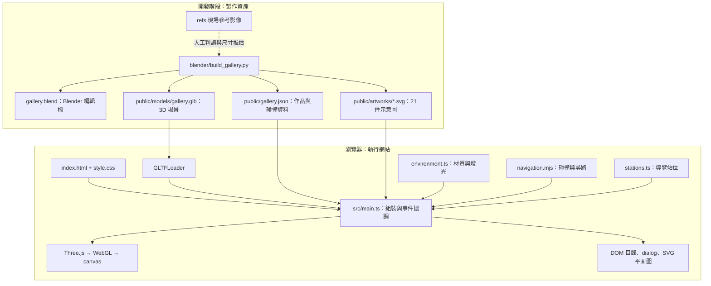
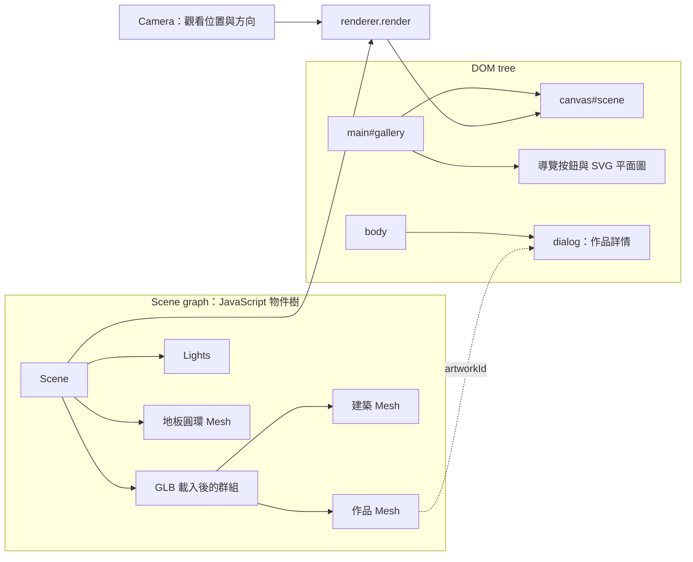
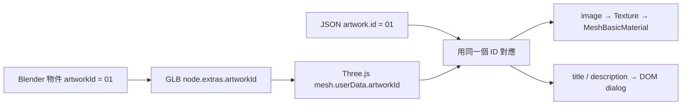
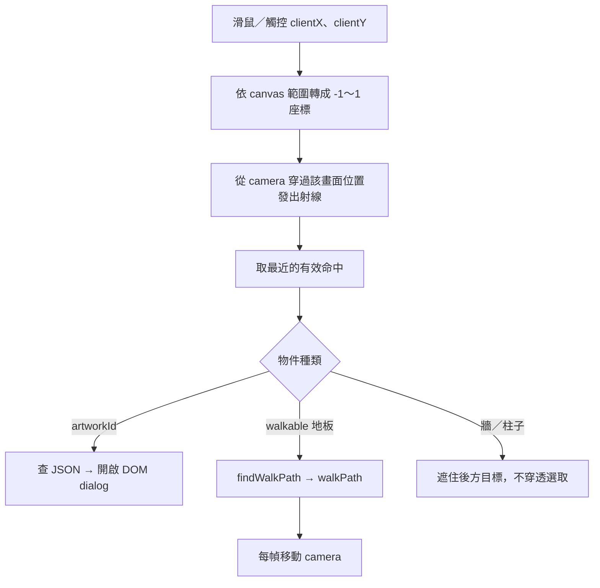

# 從前端走進 3D：專案架構導讀

本文件依 2026-09-08 的程式碼整理，對象是熟悉前端開發、剛接觸 3D 的開發者。

這是一個靜態網站：原生 TypeScript 管理互動與 DOM，Three.js 在 `<canvas>` 畫出展場，Blender Python 腳本在開發階段產生資產。沒有 React／Vue、後端 API、資料庫或物理引擎；`fetch()` 讀取的是靜態 JSON。

## 1. 先看全貌：資產製作與瀏覽器執行



`refs/` 不會被程式自動辨識成 3D；建模腳本中的尺寸與配置是依影像人工推估。Blender 不會在訪客開啟網站時執行。

兩個建置工作各有用途：

- `pnpm model`：執行 Blender，產生或覆寫 `.blend`、GLB、JSON 與示意 SVG。
- `pnpm build`：執行 TypeScript 檢查與 Vite 建置，產生可以靜態部署的 `dist/`，不會自動執行 Blender。

`public/` 是執行期資產來源；`refs/` 與 Blender 原始檔不會隨正式網站打包。

## 2. 各檔案的責任

| 位置 | 責任 | 前端對照 |
| --- | --- | --- |
| `index.html` | 畫布、頁首、導覽、燈箱、目錄容器 | 網頁骨架與介面模板 |
| `src/style.css` | 排版、RWD、DOM 外觀、減少動態效果 | 一般 CSS；不會改變展牆材質 |
| `src/main.ts` | 載入、共用狀態、輸入事件、點選、動畫迴圈、DOM 更新 | 入口與 controller，目前多數協調邏輯集中於此 |
| `src/environment.ts` | 建築色票、toon 材質、邊線、燈光、接觸陰影色塊 | 3D 的外觀設定層；類比 design tokens，但運作方式不同於 CSS |
| `src/stations.ts` | 六個導覽站位的攝影機位置與水平朝向 | 導覽設定資料 |
| `src/navigation.mjs` | 可站立判斷、移動碰撞、地板尋路 | 不依賴 DOM／Three.js 的純函式 |
| `public/gallery.json` | 作品內容、定位資料、障礙物矩形、可走邊界 | 靜態資料契約 |
| `blender/build_gallery.py` | 建築、畫框、作品平面、識別碼、資產匯出 | 可重跑的資產產生器 |
| `tests/navigation.test.mjs` | 移動與尋路、站位、GLB ID 和圖片一致性 | Node.js 內建測試；共 11 項 |

目前的模組切分是「入口協調 + 外觀 + 導覽設定 + 純運算」。UI 狀態、資產載入與動畫還沒有各自拆成獨立模組。

## 3. 畫面其實由兩套樹組成



DOM 裡只有一個畫布，3D 畫作不會變成 21 個 HTML 元素。Three.js 維護自己的 Scene graph，把場景與攝影機交給 Renderer，最後由 WebGL 繪製成畫布中的像素。

作品目錄與燈箱仍是 DOM，因此可以使用原生按鈕、鍵盤操作、`<dialog>`、焦點管理及 CSS RWD。只要 JSON 已載入，3D 失敗時目錄仍能使用。

| 3D 概念 | 先用前端經驗理解 | 本專案的例子 |
| --- | --- | --- |
| Scene | 類似元素樹的根節點 | 展場、燈光、地板標記的容器 |
| Mesh | 可以被畫出的幾何物件 | 牆、柱、作品平面 |
| Geometry | 形狀、頂點與三角形 | 柱子的長方體、作品的矩形平面 |
| Material | 表面要如何著色 | 奶油色展牆、畫作圖片材質 |
| Texture | 貼在表面的圖片資料 | `artworks/01.svg` 載入後成為貼圖 |
| UV | 表面頂點對應圖片哪個位置 | 用 0～1 座標把圖片四角對上作品平面四角 |
| Camera | 可移動、可旋轉的觀看視角 | 訪客在展場中的眼睛 |
| Renderer | 把場景與視角轉成像素的繪製器 | `WebGLRenderer` |

這些是幫助入門的類比：Scene graph 沒有 HTML 的排版機制，Material 也沒有 CSS cascade。

## 4. 一幅畫如何接上前端資料

作品的畫框是有厚度的建築幾何；顯示圖片的部分是前方一個矩形 Mesh。可先理解成「薄畫框 + 貼上圖片的平面」，不需要把圖片內容建模成雕塑。



在 `init()` 中，程式依序讀 JSON、建立 DOM 目錄、建立 Renderer、載入 GLB，再並行載入作品圖片。之後走訪 GLB 中的 Mesh：有 `artworkId` 的套上圖片材質，其餘交給 `environment.apply()`。

**ID 是資料與模型的接點。** `gallery.json` 中的 `position`、`rotation` 主要供「前往作品位置」計算使用，桌前或柱旁作品另有 `viewPosition` 指定安全站位；真正顯示的畫作位置與幾何來自 GLB。只改 JSON 座標，不會把牆上的畫搬走。

`src/artwork.ts` 定義作品資料契約，`detailsEnabled` 是必要 boolean。兩張大型背板設為 `false`，仍套用圖片並保留射線遮擋；可互動目錄由 `getDetailArtworks()` 篩選，開啟詳情與上下件共用該清單。缺少或非 `true` 的值不啟用詳情。TypeScript interface 提供編譯期型別，目前沒有完整 JSON 執行期 schema 驗證。

## 5. 空間座標：先把 3D 拆成平面與高度

Three.js 這邊採 Y-up：X 左右、Y 高度、Z 前後。本專案把世界單位當作公尺使用，但 Three.js 本身不強制單位。外框約 10.8 × 10.2 公尺，依標註圖比例與 30 坪主空間推估，尚未量測。

```text
                  -Z：簽到桌／服務台
                  ↑
     -X：左側展牆 ← 地板原點 → +X：落地窗
                  ↓
                  +Z：主展牆

     Y 軸垂直地板；攝影機眼高固定在 Y = 1.65
```

初始導覽位置由 `gallery.json` 的 `layout.entrance` 提供，目前是 `[2.72, 1.65, -0.65]`；位置在已確認的右上門口內側，`yaw=1.1` 朝柱子與展場觀看，服務台在右側。這不是 CSS 的 left／top，也不是相對目前視窗的像素。

`yaw` 是左右轉頭，`pitch` 是上下看；程式使用 radians。`yaw = 0` 朝 -Z，`yaw = π/2` 朝 -X。W 鍵代表沿目前朝向前進，因此轉頭後 W 的世界座標方向也會改變。現在沒有跳躍、樓梯或重力；行走只更新 X、Z。

Blender 採 Z-up，所以腳本的 `xyz()` 把 Three.js 語意的 `(x, y, z)` 轉成 Blender 的 `(x, -z, y)`，匯出時用 `export_yup=True` 回到網頁採用的座標。

Camera 是 `PerspectiveCamera(72, 1, 0.05, 45)`：72° 是**垂直** FOV；aspect 隨畫布寬高更新；near／far 是前後裁切平面。透視投影會產生近大遠小。FOV 改變可見範圍，移動 camera 則改變觀看位置，兩者不同。參考 [PerspectiveCamera 官方文件](https://threejs.org/docs/pages/PerspectiveCamera.html)。

## 6. 點畫作與點地板共用一次 3D 命中測試

DOM 點擊通常直接得到 `event.target`；點畫布時得到的 target 只有 canvas。要知道畫面中的哪個 3D 物件被點到，需要 Raycaster。



`hitAt()` 會對建築也做命中測試，所以不能隔著柱子選到畫作。描邊、陰影色塊與地板圓環停用 raycast，避免裝飾物擋住點選。射線命中與滑鼠位置的用途可參考 [Raycaster 官方文件](https://threejs.org/docs/pages/Raycaster.html)。

拖曳距離小於 7 才當成點擊；拖曳則更新 yaw／pitch。地板可點選的標記來自原始材質名稱 `Concrete`，並要求命中位置接近 `Y = 0`。

## 7. 看起來是 3D，碰撞卻是 2D

顯示幾何與碰撞幾何是不同資料。GLB 有樑、管線、畫框等細節；`gallery.json` 的 colliders 包含入口隔間、開啟的門扇、兩根方柱、柱前落地畫作、服務台、簽到桌及三張椅子；門洞保留可通行空間。外牆由可站立中心的 `bounds` 限制，並非每個可見 Mesh 都會自動阻擋行走。

訪客以半徑 0.24 的圓代表地板占位，不是沒有體積的一個點。

- `canOccupy()`：中心是否在 bounds 內、圓是否撞到任一矩形。
- `movePosition()`：把移動切成不大於 0.1 的小步，分別測試 X 與 Z，避免一步穿過柱子，並允許沿障礙物滑動。
- `segmentClear()`：檢查兩點間整段路徑及攝影機半徑的淨空。
- `findWalkPath()`：能直達就回傳終點；否則在障礙物外側四角放候選點，連接可通行線段，再以 Dijkstra 方式尋找候選圖上的最短路徑；無路可走就回傳 `null`。

這是適合小型、平坦展場的 visibility graph。候選點圖上的最短路徑不等於任意連續空間的精確最短路徑。目前没有 navmesh、A* 格網、剛體物理或角色模型。

注意兩種移動的差異：**點地板會尋路行走；點展區或定位作品會立即換位置，再平順轉頭。** `goTo()` 沒有沿兩站中間走過去。

## 8. 動畫迴圈：事件改狀態，每幀改畫面

```text
DOM / Pointer / Keyboard 事件
  └─ 修改 keys、yaw、pitch、walkPath、transition
       └─ renderer.setAnimationLoop(animate)
            ├─ 計算 dt，最大 0.05 秒
            ├─ 更新轉頭與攝影機位置
            ├─ 同步 SVG 平面圖標記
            └─ renderer.render(scene, camera)
```

這裡沒有 Vue／React 的 reactive rerender。JS 直接修改 camera 的屬性，下一次 render 再把新視角畫出來。鍵盤速度是每秒 2 個世界單位，實際每幀位移乘上 `dt`；自動移動最高每秒 2.6，最後一段接近目的地時減速。

開啟 dialog 會清除輸入、停止行走；失焦、隱藏頁面也會重設輸入。頁面隱藏時 `animate()` 提早返回。系統開啟減少動態效果時，地板目的地仍先驗證可到達，再直接定位。

## 9. 展場外觀在哪裡決定

`environment.ts` 依 GLB 原始材質的 `name` 套上共用 `MeshToonMaterial`。三階 gradient map 使用 `[48, 142, 245]` 與 `NearestFilter`，形成分段明暗；`EdgesGeometry` 擷取幾何邊線，產生建築描邊。

| 畫面部分 | 目前實作 | 調整入口 |
| --- | --- | --- |
| 牆面、樑、地板 | Toon 材質與共用色票 | `environment.ts` 的 `palette` |
| 作品圖片 | `MeshBasicMaterial({ map })`，不受場景燈光明暗影響 | `main.ts` 的 GLB 走訪與貼圖載入 |
| 場景照明 | HemisphereLight、AmbientLight、DirectionalLight | `environment.ts` 的 `light()` |
| 接觸陰影 | 放在地板上的半透明扁平幾何 | `environment.ts` 的 `light()` |
| 按鈕、目錄、燈箱 | DOM 與 CSS | `index.html`、`style.css` |

這些地板陰影是視覺色塊，沒有啟用即時 shadow map。Blender 裡留有預覽用燈光與 Camera，但 GLB 匯出時排除了兩者；網頁自行建立燈光與 Camera。作品採用不受燈光影響的材質，避免展場明暗改變作品內容；參考 [MeshBasicMaterial 官方文件](https://threejs.org/docs/pages/MeshBasicMaterial.html)。

靜態建築在 Blender 依材質合併，以減少 draw call。draw call 可以先理解成「CPU 請 GPU 畫一批東西的一次提交」；Mesh 數量、材質切換、描邊與陰影等都會影響提交數，不能直接把三角形數量當作 draw call 數量。

標準畫質將 pixel ratio 上限設為 1.25，高畫質上限為 2。畫布實際繪製像素量大致隨 pixel ratio 的平方增加，所以高畫質的成本不只增加一點點；實際效能仍取決於 GPU 與視角。

## 10. 接手修改時的閱讀路線

1. 先看 `index.html`，分辨 DOM UI 和 canvas。
2. 看 `main.ts` 的 `init()`，掌握 JSON、GLB、圖片如何組裝。
3. 看 `animate()`，理解每幀怎麼改攝影機與繪圖。
4. 看 `hitAt()` 與 pointer 事件，理解 2D 點擊如何變成 3D 選取。
5. 看 `navigation.mjs`，以熟悉的純函式方式理解空間運算。
6. 要調風格再看 `environment.ts`，要改實體展場才進 `build_gallery.py`。

| 想改什麼 | 要改哪裡 | 是否需要重建模型 |
| --- | --- | --- |
| 作品標題、介紹、圖片 | `gallery.json` 與 `public/artworks/` | 同比例、同位置時不用 |
| 展區導覽位置、朝向 | `stations.ts` | 不用 |
| 牆面顏色、toon 明暗、燈光 | `environment.ts` | 不用 |
| 行走速度、拖曳靈敏度、燈箱互動 | `main.ts` | 不用 |
| 碰撞半徑或尋路方式 | `navigation.mjs` | 不用 |
| 房間尺寸、柱子、作品平面位置／比例 | `build_gallery.py`，或同步修改模型與相關資料 | 需要更新 GLB，並保持 JSON 一致 |

有兩個容易忽略的資料契約：`artworkId` 連接作品資料；材質名稱連接外觀設定，`Concrete` 還參與地板判定。改模型名稱與材質時，需要一起核對前端。

重新執行建模腳本會覆寫作品資料及圖片；正式內容若要長期維護，應先從示意資產產生器分離。`.blend` 的手動編輯也不會自動回寫 Python。

建議從「改一面牆的色票 → 改一個站位 → 換一幅作品圖片 → 改一個柱子位置並同步碰撞」練習，逐步接觸 Material、Camera、Texture、Geometry 與座標資料。
